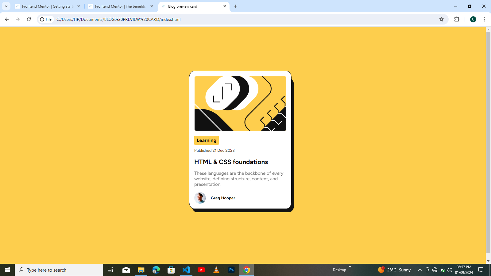

# Frontend Mentor - Blog preview card solution

This is a solution to the [Blog preview card challenge on Frontend Mentor](https://www.frontendmentor.io/challenges/blog-preview-card-ckPaj01IcS). Frontend Mentor challenges help you improve your coding skills by building realistic projects. 

## Table of contents

- [Overview]
  - [The challenge]
  - [Screenshot]
  - [Links]
  - [Built with]
- [Author]

## Overview

This project is a responsive landing page built with HTML and CSS designed to showcase a fictional blog preview card. The layout is fully responsive, ensuring a great user experience on both mobile devices and laptop screens.

### The challenge

- Challenge description

This project was a Frontend Mentor challenge to build a reponsive landing page. The objective was to accurately replicate a provided design and ensure the layout is fully responsive across mobile and laptop screen sizes.

- Challenge requirements

 Replicate the design as closely as possible using HTML and CSS
 Implement a mobile-firsgt design approach
 Ensure the page is accessible and follows best practices for SEO
 Include hover states for interactive elements

- Personal goals 
 Impprove my skills in Flexbox and CSS Grid
 Practice writing clean codes

### Screenshot

### Links

- Solution URL: 
- Live Site URL: 

### Built with

- Semantic HTML5 markup
- CSS custom properties
- Flexbox
- CSS Grid
- Mobile-first workflow

## Author

- Frontend Mentor - @Josh1407
